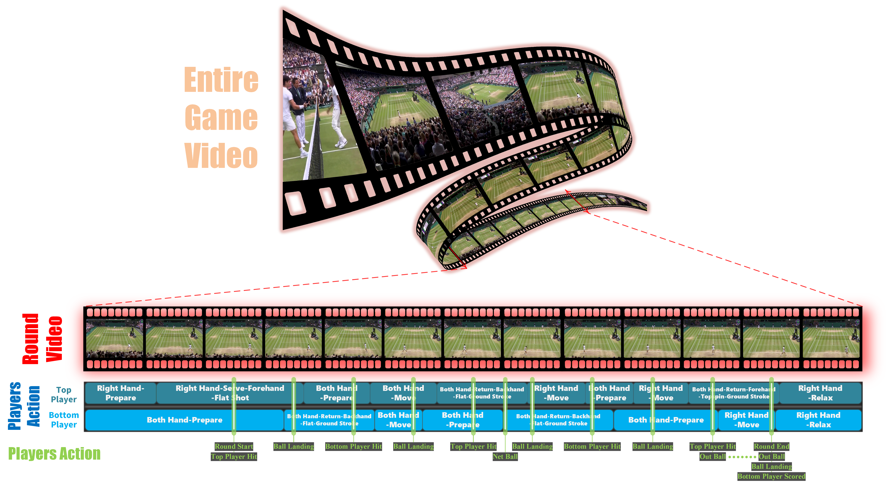

# TennisnNet: A Multi-Granularity Video Dataset for Broadcast Tennis Competition Understanding

TennisNet is a dense-labeled video dataset for fine-grained understanding of professional tennis matches. Unlike directly using the complete match videos, TennisNet is constructed based on scoring rallies as the core unit. We remove non-main match content such as highlights, close-ups, audience shots, empty shots of the court, and intervals of waiting between sets from the original broadcast videos, and retain the complete match process from the preparation before the serve or the toss of the ball to the serve error, the end of the rally, or the score of one side. This design can reduce the interference of irrelevant images on the model training and make the dataset more focused on serving for the understanding of tennis movements, match events, and rally structures.

The current version of TennisNet contains 1,487 scoring rally segments, with a total duration of 220.2 minutes, a total of 494,963 frames, and 5,010,298 frame-level timestamp annotations. The videos are from professional tennis event broadcasts, covering three main court types: clay, hard, and grass, and also including men's singles and women's singles matches. Therefore, it can be used to evaluate the model's generalization ability under different courts, genders, and visual conditions.



## Statistics
<table>
	<thead>
		<tr>
			<th rowspan="3"></th>
			<th rowspan="2" colspan="2">Clay Court</th>
			<th colspan="5">Hard Court</th>
			<th rowspan="2" colspan="2">Grass Court</th>
		</tr>
		<tr>
			<th colspan="2">Blue</th>
			<th colspan="2">Blue-green</th>
			<th>Black</th>
		</tr>
		<tr>
			<th>M.S.</th>
			<th>L.S.</th>
			<th>M.S.</th>
			<th>L.S.</th>
			<th>M.S.</th>
			<th>L.S.</th>
			<th>M.S.</th>
			<th>M.S.</th>
			<th>L.S.</th>
		</tr>
	</thead>
	<tbody>
		<tr>
			<th rowspan="5">Video Num. <br/> / <br/> Time (min.) <br/> / <br/> Frame Num. </th>
			<td align="center">191</td>
			<td align="center">97</td>
			<td align="center">211</td>
			<td align="center">136</td>
			<td align="center">246</td>
			<td align="center">153</td>
			<td align="center">43</td>
			<td align="center">265</td>
			<td align="center">145</td>
		</tr>
		<tr>
			<td align="center">28.3</td>
			<td align="center">12.6</td>
			<td align="center">31.3</td>
			<td align="center">16.4</td>
			<td align="center">45.5</td>
			<td align="center">26.4</td>
			<td align="center">9.4</td>
			<td align="center">31.0</td>
			<td align="center">19.2</td>
		</tr>
		<tr>
			<td align="center">42,438</td>
			<td align="center">18,864</td>
			<td align="center">56,190</td>
			<td align="center">29,455</td>
			<td align="center">163,797</td>
			<td align="center">94,818</td>
			<td align="center">14,103</td>
			<td align="center">46,476</td>
			<td align="center">28,822</td>
		</tr>
		<tr>
			<td colspan="2" align="center">288 / 41.0 / 61,302</td>
			<td colspan="5" align="center">788 / 129.0 / 358,363</td>
			<td colspan="2" align="center">410 / 50.2 / 75,298</td>
		</tr>
    <tr>
			<td colspan="9" align="center">1487 / 220.2 / 494,963</td>
		</tr>
	</tbody>
</table>

## Json Struction
Below is an example of the JSON data structure for the labels file of TennisNet:

```json
{
	"video_id": "...",
	"frame_num": 12345,
	"frame_rate": 25,
	"resolution": [W, H],
	"original_video_url": "...",
	"frame_range": [start_frame, end_frame],
	"data": [
		{
			"frame": 1,
			"players": {
				"details": [
					{
						"id": 0,
						"visible": 1,
						"bbox": [x, y, w, h],
						"action": {
							"action": "prepare",
							"racket_hand": "both",
							"Batting_style": "none",
							"shot_type": "none",
							"skill": "none"
						}
					}
					/* ... more player data ... */
				]
			},
			"action": ["begin", "hit_top"]
		}
		/* ... more frame data ... */
	]
}
```

说明：
- `video_id`: 字符串，视频唯一标识。
- `frame_num`: 总帧数。
- `frame_rate`: 帧率（fps）。
- `resolution`: 宽高 `[W, H]`。
- `frame_range`: 本段视频在原始视频中的起止帧号。
- `data`: 每帧的标注数组，按帧排序。
- `players.details`: 每个球员在该帧的位置/可见性/动作信息。


## License

The annotations, metadata, label definitions, and official train/validation/test splits in this repository are licensed under the Creative Commons Attribution-NonCommercial 4.0 International License (CC BY-NC 4.0).

The source code and utility scripts in the tools directory are licensed under the MIT License.

This repository does not host, redistribute, or license the original video files. All original videos remain the property of their respective copyright holders. Users are responsible for accessing the videos from the original platforms in accordance with their terms of service.
